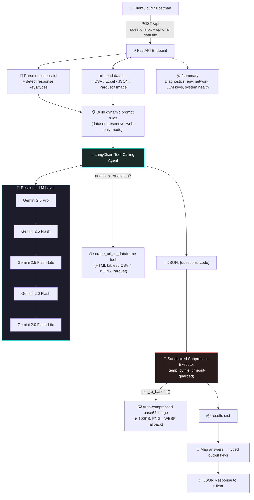
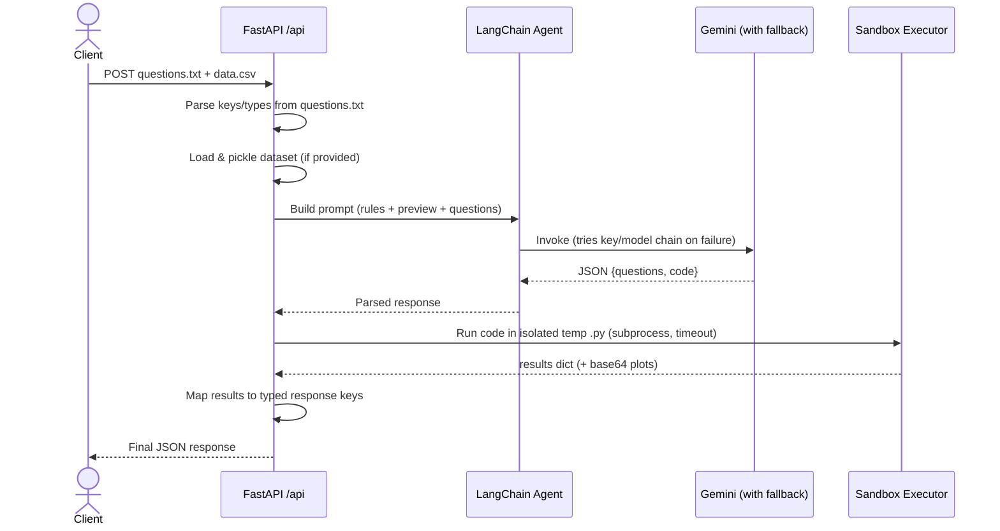
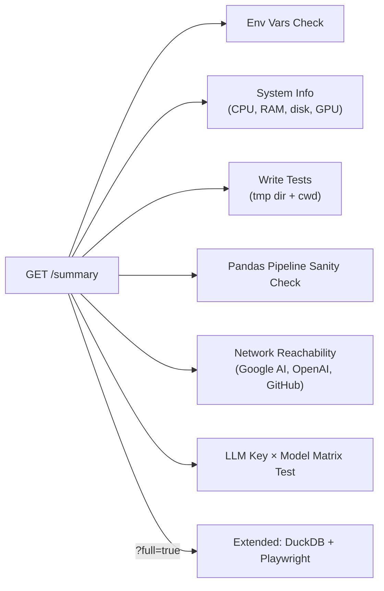

<div align="center">


<br/>

[](https://www.python.org/)
[](https://fastapi.tiangolo.com/)
[](https://www.langchain.com/)
[](https://ai.google.dev/)
[](LICENSE)

[](https://github.com/saumyakumarchauhan/data-analyst-agent)
[](https://github.com/saumyakumarchauhan/data-analyst-agent)

</div>

---

## 📖 Table of Contents

- [What Is This?](#-what-is-this)
- [Why This Exists](#-why-this-exists)
- [System Architecture (HLD)](#-system-architecture-hld)
- [Request Lifecycle](#-request-lifecycle-sequence)
- [Core Concepts](#-core-concepts--how-it-actually-works)
- [Key Features](#-key-features)
- [Tech Stack](#-tech-stack)
- [Getting Started](#-getting-started)
- [API Reference](#-api-reference)
- [Usage Examples](#-usage-examples)
- [Reliability Engineering](#-reliability-engineering)
- [Diagnostics Endpoint](#-diagnostics-endpoint-summary)
- [Project Structure](#-project-structure)
- [Roadmap](#-roadmap)
- [License](#-license)

---

## 🧠 What Is This?

**Data Analyst Agent** is a self-contained API that turns a plain-English question file — optionally paired with a dataset — into **scraped data, executed Python analysis, and rendered visualizations**, entirely autonomously.

You send it a `questions.txt` (and optionally a `.csv`/`.xlsx`/`.json`/`.parquet`/image file). It:

1. Reads your questions
2. Decides whether it needs to scrape the web or use your uploaded data
3. Writes and **executes real Python code** in an isolated subprocess to compute the answers
4. Returns clean JSON — including base64-encoded plots — within the time budget

No notebooks. No manual wrangling. Just a question in, an answer out.

> Built as the **Data Analyst Agent** project for the *Tools in Data Science* (TDS) curriculum — designed to satisfy graded evaluation rubrics that check exact values, correlation coefficients, and even the visual correctness of generated plots.

---

## 🎯 Why This Exists

Traditional "chat with your CSV" tools stop at generating a text answer. This agent goes further:

- It **writes code**, not just an explanation
- It **runs that code in a sandbox** and captures real, computed output — not a hallucinated number
- It **self-corrects**: if the generated code fails (e.g. a wrong column name), it retries instead of just erroring out
- It **survives flaky API keys** by rotating across multiple Gemini keys and model tiers automatically

---

## 🏗 System Architecture (HLD)



---

## 🔄 Request Lifecycle (Sequence)



---

## 💡 Core Concepts — How It Actually Works

### 1. The Agent Doesn't Just "Answer" — It Writes and Runs Code
The LLM is instructed to return **strict JSON** containing a `questions` array and a `code` string. That code is injected into a template (imports, a `plot_to_base64()` helper, the scraper function) and executed as a **real subprocess** — not `eval()`'d in-process. This means:
- Crashes in generated code can't take down the API server
- Execution is timeout-bounded (`LLM_TIMEOUT_SECONDS`, default 240s)
- Temp files (`.py` script, `.pkl` dataframe) are cleaned up after every run

### 2. Resilient Multi-Key, Multi-Model LLM Layer
Instead of a single API key and a single model, the agent maintains a **hierarchy**:

```
gemini-2.5-pro → gemini-2.5-flash → gemini-2.5-flash-lite → gemini-2.0-flash → gemini-2.0-flash-lite
```

For every model, it cycles through **all configured API keys** (`gemini_api_1` … `gemini_api_10`) until one succeeds. Quota errors, rate limits, and transient failures are logged separately so you can see exactly which key/model combo is misbehaving — surfaced live via the `/summary` diagnostics route.

### 3. Smart Image Compression for Plot Responses
Evaluation rubrics often require base64 images **under 100,000 bytes**. The `plot_to_base64()` helper handles this automatically:
1. Save at `dpi=100` → check size
2. Progressively drop to `dpi=80, 60, 50, 40, 30`
3. Still too big? Convert PNG → **WEBP** (much better compression) at quality 80, then 60
4. Last resort: return a heavily downsampled PNG regardless of size

### 4. Context-Aware Prompting
The rules sent to the LLM **change depending on whether a dataset was uploaded**:
- **Dataset present** → forbid scraping, force it to use `df`/`data` only
- **No dataset** → explicitly allow `scrape_url_to_dataframe(url)` calls

### 5. Universal Web Scraper
One tool, many formats. `scrape_url_to_dataframe` auto-detects and parses:

| Source Type | Handling |
|---|---|
| `.csv` | `pandas.read_csv` |
| `.xlsx` / `.xls` | `pandas.read_excel` |
| `.parquet` | `pandas.read_parquet` |
| `.json` / JSON content-type | `pandas.json_normalize` |
| HTML pages (e.g. Wikipedia) | First `<table>` via `pandas.read_html`, falls back to plain text extraction via BeautifulSoup |
| Anything else | Raw text wrapped in a single-column DataFrame |

### 6. Typed, Ordered Output Mapping
If your `questions.txt` declares expected keys like `` `Which court...`: string ``, the agent parses those key/type declarations up front and casts each answer (`int`, `float`, `str`) before returning — so your evaluator always gets the right type.

---

## ✨ Key Features

<div align="center">

| Feature | Description |
|---|---|
| 🤖 **Agentic Reasoning** | LangChain tool-calling agent decides *what code to write*, not just what to say |
| 🔁 **Self-Healing LLM Calls** | Automatic fallback across 5 model tiers × up to 10 API keys |
| 🧪 **Sandboxed Execution** | Every answer is computed by real, isolated Python — not guessed by the LLM |
| 🌐 **Universal Scraper** | HTML tables, CSV, Excel, Parquet, JSON — one function, all formats |
| 🖼 **Auto-Compressed Plots** | Guarantees base64 images stay under strict size limits (PNG → WEBP fallback) |
| 📂 **Multi-Format Uploads** | CSV, Excel, JSON, Parquet, and even images as input datasets |
| 🩺 **Live Diagnostics** | `/summary` endpoint probes env vars, network reachability, LLM key health, system resources |
| ⏱ **Timeout-Guarded** | Hard timeouts on both the LLM call and code execution to meet strict SLAs |
| 🔑 **Typed Response Casting** | Declares and enforces `int` / `float` / `string` per answer key |

</div>

---

## 🛠 Tech Stack

<div align="center">


</div>

| Layer | Choice | Why |
|---|---|---|
| Web framework | **FastAPI** | Async, fast, native multipart/form-data support for file uploads |
| Orchestration | **LangChain** (`create_tool_calling_agent` + `AgentExecutor`) | Structured tool-calling with a defined prompt contract |
| LLM | **Google Gemini** (2.5 Pro → 2.0 Flash-Lite hierarchy) | Cost/quality fallback ladder |
| Data handling | **Pandas / NumPy** | DataFrame-first pipeline for any tabular source |
| Visualization | **Matplotlib / Seaborn** | Rendered server-side, compressed, returned as base64 |
| Execution sandbox | **subprocess + tempfile** | Isolates arbitrary LLM-generated code from the main process |
| Diagnostics | **psutil, httpx, asyncio** | Live system, network, and LLM-key health reporting |

---

## 🚀 Getting Started

### 1️⃣ Clone the repo
```bash
git clone https://github.com/your-username/data-analyst-agent.git
cd data-analyst-agent
```

### 2️⃣ Install dependencies
```bash
pip install -r requirements.txt
```

### 3️⃣ Configure environment variables
Create a `.env` file in the project root:
```env
gemini_api_1=your_first_gemini_key
gemini_api_2=your_second_gemini_key
# ...add up to gemini_api_10 for maximum fallback resilience
LLM_TIMEOUT_SECONDS=240
PORT=8000
```

### 4️⃣ Run the server
```bash
python -m uvicorn app:app --reload
```

Visit **http://localhost:8000/** 🌐 or hit the API directly at **http://localhost:8000/api**.

---

## 📡 API Reference

| Method | Endpoint | Description |
|---|---|---|
| `GET` | `/` | Serves the frontend UI (`index.html`) |
| `POST` | `/api` | Main analysis endpoint — accepts `questions.txt` + optional data file |
| `GET` | `/api` | Health check / usage hint |
| `GET` | `/summary` | Full diagnostics report (env, system, network, LLM key health) |
| `GET` | `/favicon.ico` | Serves favicon (falls back to a transparent pixel) |

### Request contract (`POST /api`)

- `questions.txt` — **always required**. Plain text describing the task and questions.
- Zero or more additional files — a dataset (`.csv`, `.xlsx`, `.xls`, `.json`, `.parquet`) and/or an image (`.png`, `.jpg`, `.jpeg`).
- **Response SLA:** answers must be returned within the configured timeout window.

---

## 🧪 Usage Examples

### Example 1 — Scrape + Analyze (no dataset upload)

**`questions.txt`**
```text
Scrape the list of highest grossing films from Wikipedia. It is at the URL:
https://en.wikipedia.org/wiki/List_of_highest-grossing_films

Answer the following questions and respond with a JSON array of strings:

1. How many $2 bn movies were released before 2000?
2. Which is the earliest film that grossed over $1.5 bn?
3. What's the correlation between the Rank and Peak?
4. Draw a scatterplot of Rank and Peak with a dotted red regression line.
   Return as a base64 data URI under 100,000 bytes.
```

**Call it:**
```bash
curl "http://localhost:8000/api" -F "questions.txt=@questions.txt"
```

**Sample response:**
```json
[
  1,
  "Titanic",
  0.485782,
  "data:image/png;base64,iVBORw0KG..."
]
```

### Example 2 — Bring Your Own Dataset

```bash
curl "http://localhost:8000/api" \
  -F "questions.txt=@questions.txt" \
  -F "data.csv=@sales_data.csv"
```

When a dataset is uploaded, the agent is instructed to **only** use `df` / `data` — no web scraping is attempted, keeping answers grounded strictly in your file.

### Example 3 — Large External Dataset (DuckDB-style workloads)

```text
Which high court disposed the most cases from 2019–2022?
What's the regression slope of date_of_registration vs decision_date for court=33_10?
Plot the year vs. days of delay as a scatterplot with a regression line,
encoded as a base64 data URI under 100,000 characters.
```

```bash
curl "http://localhost:8000/api" -F "questions.txt=@questions.txt"
```

```json
{
  "Which high court disposed the most cases from 2019 - 2022?": "...",
  "What's the regression slope of the date_of_registration - decision_date by year in the court=33_10?": "...",
  "Plot the year and # of days of delay from the above question as a scatterplot with a regression line...": "data:image/webp;base64,..."
}
```

### Example 4 — Check System Health
```bash
curl "http://localhost:8000/summary?full=true"
```
Returns environment status, system resources, network reachability to Google AI / OpenAI / GitHub, and a per-key/per-model LLM health report — invaluable when debugging quota exhaustion.


### 🔗 More Example Datasets & Questions

For additional datasets and practice questions, you can refer to the following resources:

- [Sales Dataset (Tools in Data Science)](https://github.com/sanand0/tools-in-data-science-public/tree/main/project-data-analyst/sales/)
- [Network Dataset (Tools in Data Science)](https://github.com/sanand0/tools-in-data-science-public/tree/main/project-data-analyst/network/)
- [Weather Dataset (Tools in Data Science)](https://github.com/sanand0/tools-in-data-science-public/tree/main/project-data-analyst/weather/) 


---

## 🛡 Reliability Engineering

This isn't a demo script — it's built to survive real evaluation conditions with hard timeouts and flaky third-party APIs:

- ✅ **Retry loop** — the agent retries up to 3 times if the LLM returns an empty response
- ✅ **Self-correcting execution** — malformed generated code (e.g. wrong column names) surfaces a clear execution error rather than a silent crash, enabling retry logic upstream
- ✅ **Key/model rotation** — quota errors on one key silently fall through to the next key or model tier
- ✅ **Isolated execution** — every run happens in a fresh subprocess with its own temp files, cleaned up unconditionally in a `finally` block
- ✅ **Threaded timeout wrapper** — the entire agent + execution pipeline runs inside a `ThreadPoolExecutor` with a hard timeout, guaranteeing the API responds (even with an error) instead of hanging

---

## 🩺 Diagnostics Endpoint (`/summary`)

A built-in health-check surface for production debugging:



Every check runs **concurrently** via `asyncio.gather`, so a full diagnostic sweep — including testing every Gemini key against every model tier — typically completes in seconds, not minutes.

---

## 📂 Project Structure

```
data-analyst-agent/
├── app.py                 # FastAPI app, agent, sandbox executor, diagnostics
├── index.html             # Optional minimal frontend
├── requirements.txt       # Python dependencies
├── .env                   # API keys & config (not committed)
├── LICENSE                # MIT License
└── README.md              # You are here
```

---

## 🗺 Roadmap

- [ ] Streaming responses for long-running analyses
- [ ] Pluggable model providers beyond Gemini (OpenAI, Anthropic, local Ollama)
- [ ] Persistent caching of scraped datasets
- [ ] Multi-file / multi-dataset joins in a single request

---

## 📜 License

Licensed under the **MIT License** — free for personal and commercial use. See [`LICENSE`](LICENSE) for details.

<div align="center">


Made with ☕, Python, and a healthy fear of flaky APIs.

</div>
